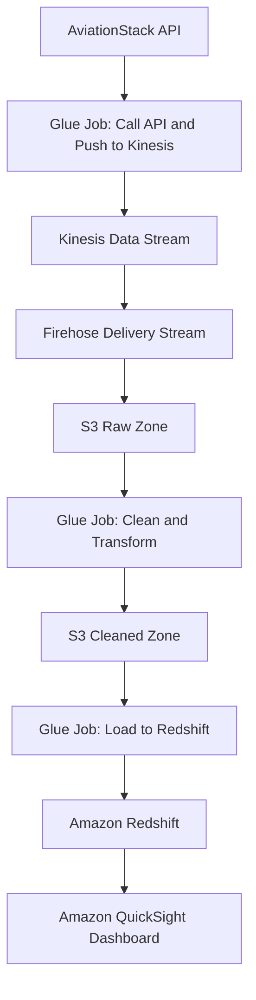
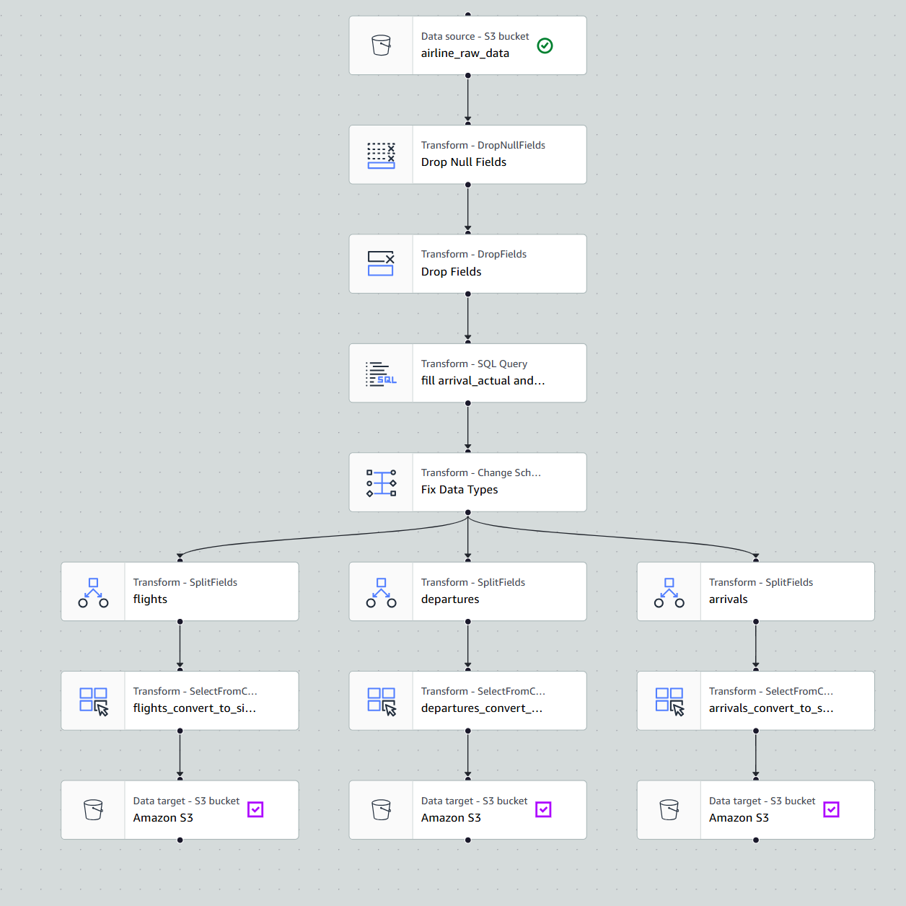
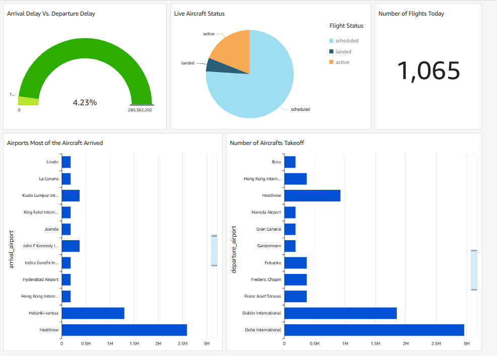

# ✈️ Real-Time Aircraft Movement Tracker

## 📌 Project Overview  
Built a real-time ETL pipeline using AWS services to analyze global flight activity data from the **AviationStack API** and display insights on an  dashboard. This end-to-end data engineering project enables aviation companies to monitor real-time aircraft status, delays, and airport congestion trends

---

## 🛠️ Technologies Used
- ⚙️ **AWS EventBridge** – Orchestrates ETL workflows every 15 minutes  
- 🔁 **Amazon Kinesis & Firehose** – Streams real-time flight data to S3  
- 🧹 **AWS Glue** – Performs data transformation and loads to Redshift  
- 🗂️ **Amazon S3** – Stores raw and cleaned datasets in Parquet format with Snappy compression  
- 🧠 **Amazon Redshift** – Data warehousing and querying engine  
- 📊 **Amazon QuickSight** – Interactive dashboards and data visualization  
- 🐍 **Python + Boto3** – For API integration and scripting Glue logic  
- 🛎️ **CloudWatch** – Pipeline monitoring 

---

## 🧱 Architecture Overview

---

  

## 🔄 Workflow Breakdown

This section breaks down the real-time data pipeline, step-by-step, as shown in the diagram. This pipeline is all about ETL (Extract, Transform, Load) processes, reporting, and real-time monitoring!

### ETL Pipeline 🔄

1. **Data Ingestion via Glue Job 📦**: The pipeline kicks off with a Glue Job. This job extracts data from an initial source 📥, which could be a database, API, or any other data source. The data related to the calls from Aviation Stack API.

   👉[Data Ingestion Script](Scripts/Get-data-from-AviationStack.ipynb)

2. **Kinesis Stream 🌊**: Extracted data then flows through Amazon Kinesis, enabling real-time data streaming. Kinesis helps handle high-velocity data!

3. **Kinesis Firehose 🚒**: Kinesis Data Firehose takes over, delivering the streamed data to Amazon S3 Raw Zone for storage.

4. **S3 Raw Zone 🪣**: The raw data lands in an S3 bucket designated as the "Raw Zone." This is the initial storage location for unprocessed data.

5. **Lambda Trigger ETL Job (1) ⚡**: When data arrives in the S3 Raw Zone, it triggers a Lambda function. This Lambda function, in turn, calls a Glue ETL job to transform the raw data into a usable format.

   👉[Lambda ETL Trigger Script](Scripts/S3-Raw-Zone-Lambda-Trigger.py)

6.  **ETL High-Level Description** 🏗️

    The ETL process in this pipeline involves several steps to transform raw data into a structured format suitable for analysis and reporting:

	

- **Data Extraction 📥**: The initial Glue Job extracts data from Aviation Stack API and other sources. This involves collecting raw data from various systems.

- **Data Transformation ⚙️**:
  - **Standardization**: Drop Null fields, drop fields, and rename fields for easy interpretation.
  - **Data Type Conversion**: SQL Query used to convert field types from string to respective data types.
  - **Splitting Fields**: Data is split for flights, arrivals, departures to fit it into their respective consent forms.

- **Data Loading 📤**: The transformed data is then loaded into Amazon Redshift, making it available for querying and reporting.

  👉[ETL Script](Scripts/ad_etl.ipynb)

7. **S3 Cleaned Zone ✨**: The transformed (cleaned) data is now stored in another S3 bucket, referred to as the "Cleaned Zone." The data is structured and ready for further analysis.

8. **Lambda Trigger & ETL Job (2) 💡**: The presence of data in S3 Cleaned Zone triggers yet another Lambda function. This Lambda function then initiates a Glue job to load the cleaned data into Amazon Redshift.

	👉[Lambda Trigger Script](Scripts/S3-Cleaned-Zone-Lambda-Trigger.py)
	
	👉[Data Transfer from S3 to Redshift ETL Script](Scripts/Load-from-S3-to-Redshift.ipynb)

9. **Redshift 📊**: The final transformed data resides in an Amazon Redshift data warehouse. This is where you can perform in-depth data analysis.

### Reporting 📈

*   **QuickSight 📉**: Amazon QuickSight connects to Redshift for creating insightful data visualizations and reports

### Monitoring 🚦
  
1.  **CloudWatch 🔭**: Amazon CloudWatch constantly monitors the entire pipeline for performance metrics, errors, and overall health. It ensures everything runs smoothly

2.  **EventBridge 🌉**: CloudWatch integrates with Amazon EventBridge. This enables event-driven actions and triggering other services as needed based on the monitoring data

---
## 🔄 Data Flow Summary
1. **📥 API Ingestion**: Glue job pulls flight data (100 records per call) every 15 mins
2. **🔁 Real-Time Streaming**: Data flows through Kinesis into S3 via Firehose
3. **🧼 ETL Process**: Glue job applies transformations (schema inference, timestamp formatting)
4. **📦 Storage**: Cleaned data is stored in Parquet format with Snappy compression
5. **🏛️ Data Warehousing**: Redshift stores cleaned data for efficient querying
6. **📈 Visualization**: QuickSight dashboard provides business insights

---

## 🧪 Transformations in AWS Glue
- 🧬 **Schema Inference**  
- 🕒 **Timestamp Formatting**  
- 🔍 **Column Filtering & Cleaning**  
- 📦 **Snappy-compressed Parquet Output**

---

## 💡 Business Value
💼 This pipeline enables airline stakeholders to monitor aircraft activity, detect delays, and manage airport congestion in near real time, supporting smarter scheduling and operational decisions

---

## 🧩 Troubleshooting Notes
- ⚠️ **VPC Misconfigurations** can block communication between Glue and Redshift
  - ✅ Ensure both services share the same security configuration and subnet access
- 🛑 **API Rate Limits** (100 records/request on free tier)
  - ✅ Handled via pagination logic in Glue script
- 💰 **Cost Management**: Entire project will be deleted post-publishing to avoid AWS charges (college student hustle 💪)

---

## 🔍 Additional Details
- 📆 Pipeline runs **every 15 minutes** to simulate near real-time tracking.

---

## 📈 Why QuickSight Was Essential
Without QuickSight, the pipeline ends with raw data in Redshift — not meaningful to non-technical stakeholders.

---

## 🏁 Conclusion
This project is a demonstration of **modern, real-time data engineering** using AWS services. It covers everything from ingestion to insight delivery, showcasing automation, analytics, and infrastructure skills in a cohesive way.

---
